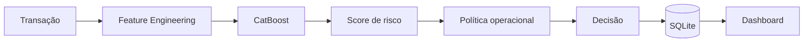
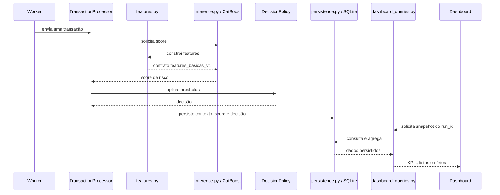

# Funcionamento do Sistema de Detecção de Fraudes

## 1. Visão geral

O `ccard_fraud_ml` é um artefato local de detecção e monitoramento de fraude em transações de cartão. Ele combina um modelo CatBoost congelado, uma política operacional explícita, persistência em SQLite e uma interface Streamlit atualizada continuamente.

O fluxo principal é:



O comando oficial para iniciar o artefato é:

```bash
python main.py
```

Esse comando inicia tanto o processamento quanto a visualização. Não é necessário abrir o worker ou o Streamlit separadamente durante a apresentação.

## 2. Inicialização

O [`main.py`](../main.py) é o orquestrador do sistema. Sua sequência real é:

1. Adquire um lock local para impedir dois `main.py` simultâneos.
2. Inicializa o SQLite e garante que o schema exista.
3. Limpa o estado operacional da execução anterior.
4. Executa checkpoint do WAL e `VACUUM` para recuperar espaço físico.
5. Gera um `run_id` interno e único.
6. Inicia o worker em um subprocesso.
7. Inicia o Streamlit em outro subprocesso.
8. Monitora os dois processos até o encerramento.

O lock é mantido pelo sistema operacional durante toda a execução. Se outra inicialização for tentada, ela é recusada antes da limpeza do banco. O arquivo de lock pode permanecer em `runtime/`, mas a trava é liberada automaticamente quando o processo termina.

Ao pressionar `Ctrl+C`, o processo principal solicita o encerramento do Streamlit e do worker. Caso algum deles não termine dentro do prazo configurado, o `main.py` força o encerramento para evitar processos órfãos.

## 3. Arquitetura em execução

```text
main.py
   |
   +-- Worker: scripts/run_live_replay.py
   |      |
   |      +-- TemporalReplay
   |      +-- TransactionProcessor
   |      +-- features.py
   |      +-- inference.py / CatBoost
   |      +-- decision_policy.py
   |      +-- persistence.py
   |      +-- SQLite (escrita)
   |
   +-- Streamlit: dashboard/app.py
          |
          +-- dashboard/views/overview.py
          +-- dashboard_queries.py
          +-- SQLite (leitura)
```

O worker escreve os resultados; o dashboard lê e agrega os mesmos dados. O SQLite é a fronteira entre processamento e visualização.

Essa separação é importante: uma atualização ou recarga do Streamlit não executa novamente o modelo e não limpa o banco.

## 4. Entrada da transação

O processamento interno utiliza registros do conjunto disponível em `raw/fraudTrain.csv`, ordenados pelo horário da transação. O worker trabalha com a fatia temporal final reservada para a demonstração operacional.

Entre os dados utilizados para construir as features estão:

- valor da transação;
- categoria do estabelecimento;
- data e horário;
- data de nascimento;
- coordenadas do cliente e do estabelecimento;
- população da cidade;
- gênero;
- estado.

Informações como nome, cidade, estabelecimento e últimos quatro dígitos são preservadas apenas como contexto operacional para o dashboard. Identificadores diretos, como número completo do cartão ou identificador da transação, não entram indiscriminadamente no conjunto de features do modelo.

## 5. Feature engineering

O [`src/features.py`](../src/features.py) transforma os dados originais no contrato congelado `features_basicas_v1`:

| Feature | Interpretação |
|---|---|
| `amt_log` | Logaritmo do valor, reduzindo a assimetria de valores muito altos. |
| `city_pop_log` | Logaritmo da população da cidade. |
| `idade` | Idade na data da transação, considerando mês e dia de nascimento. |
| `distancia_km` | Distância de Haversine entre cliente e estabelecimento. |
| `hora_sin`, `hora_cos` | Representação cíclica da hora do dia. |
| `dia_semana_sin`, `dia_semana_cos` | Representação cíclica do dia da semana. |
| `fim_de_semana` | Indicador de sábado ou domingo. |
| `category` | Categoria da transação. |
| `gender` | Gênero informado no conjunto. |
| `state` | Estado da transação. |

As representações seno/cosseno evitam tratar horários e dias como uma linha sem continuidade. Assim, 23h e 0h permanecem próximas, e domingo e segunda-feira também podem ser interpretados como pontos vizinhos do ciclo.

Valores categóricos ausentes são substituídos por `__MISSING__`. Ao final, as colunas são devolvidas exatamente na ordem exigida pelo contrato do modelo.

## 6. Modelo

O modelo congelado está em `models/catboost_v1/model.cbm` e é carregado por [`src/inference.py`](../src/inference.py).

Dados registrados no artefato:

| Propriedade | Valor |
|---|---|
| Versão | `catboost_v1` |
| Algoritmo | `CatBoostClassifier` |
| Conjunto de features | `features_basicas_v1` |
| Árvores | 719 |
| Profundidade | 6 |
| Learning rate | 0,05 |
| Seed | 42 |

Para cada transação, o modelo devolve o valor da classe positiva produzido por `predict_proba`. No sistema ele é chamado de **score de risco**. O artefato não pressupõe que esse valor seja uma probabilidade calibrada para qualquer população futura.

O `feature_contract.json` registra a ordem das features e quais colunas são categóricas. O modelo, o contrato e os metadados são artefatos congelados e não são alterados durante a execução.

## 7. Política operacional

O modelo produz um score; a política transforma esse score em ação. São responsabilidades diferentes.

A política `decision_policy_v1`, carregada de `models/catboost_v1/decision_policy.json`, é:

```text
score < 0,20
    → APROVAR

0,20 <= score < 0,90
    → REVISAR

score >= 0,90
    → ALERTA_CRITICO
```

- **APROVAR:** a operação segue sem encaminhamento adicional pela política.
- **REVISAR:** a operação exige análise intermediária.
- **ALERTA_CRITICO:** a operação atinge a faixa de maior risco prevista pela política.

Alterar o modelo mudaria a produção do score. Alterar a política mudaria o uso operacional desse score. Nenhuma dessas alterações acontece em runtime.

## 8. Transaction Processor

O [`src/transaction_processor.py`](../src/transaction_processor.py) organiza o processamento individual:

```text
recebe uma transação
        ↓
calcula o score com o modelo
        ↓
aplica a política
        ↓
organiza contexto e latência
        ↓
persiste o resultado
```

O processador exige uma transação por chamada. Ele preserva contexto como nome, estabelecimento, categoria, valor, localização e final do cartão, além do score, decisão e latência.

O campo histórico `is_fraud` é opcional para o processamento operacional. Quando existe no conjunto de demonstração, ele permite métricas retrospectivas agregadas; a inferência e a decisão não dependem dele.

## 9. SQLite e persistência

O banco padrão é `runtime/fraud_detection.db`. O schema é criado e mantido por [`src/persistence.py`](../src/persistence.py).

Existem duas tabelas operacionais:

### `transacoes_processadas`

Armazena, entre outros campos:

- `run_id` e identificador da transação;
- horário original e horário de processamento;
- contexto do cliente e estabelecimento;
- valor e categoria;
- score e decisão;
- latência;
- versão do modelo;
- versão da política;
- rótulo histórico opcional.

A combinação `run_id + trans_num` é única. Uma tentativa duplicada da mesma transação na mesma execução não cria um segundo registro.

### `replay_runs`

Controla a execução interna: status, quantidade total, progresso, último índice processado, horários, versões e eventual erro.

O SQLite opera em modo WAL. Isso permite que o worker continue escrevendo enquanto o dashboard realiza leituras. O código também configura `busy_timeout` para absorver pequenas disputas de acesso sem falhar imediatamente.

## 10. Processamento contínuo

O [`scripts/run_live_replay.py`](../scripts/run_live_replay.py) carrega e ordena o conjunto temporal. A classe [`TemporalReplay`](../src/replay.py) envia uma transação por vez ao `TransactionProcessor`, com intervalo de 0,02 segundo, e atualiza o progresso interno a cada 50 operações.

Internamente esse mecanismo usa:

- `run_id` para separar execuções;
- `replay_runs` para controlar o estado;
- `RUNNING`, `COMPLETED` ou `FAILED` como status.

Esses nomes representam infraestrutura interna. Para quem utiliza o dashboard, a experiência é simplesmente um fluxo contínuo de transações e indicadores em atualização.

Uma interrupção durante o processamento marca a execução como `FAILED`. Na próxima inicialização oficial, o estado operacional anterior é limpo antes que o novo processamento comece.

## 11. Dashboard

O [`dashboard/app.py`](../dashboard/app.py) não executa o CatBoost. Ele localiza a execução que deve acompanhar e entrega o `run_id` à visão geral.

```text
SQLite
   ↓
src/dashboard_queries.py
   ↓
dashboard/views/overview.py
   ↓
dashboard/app.py
```

Quando ainda não há uma execução registrada, o app apresenta um estado de espera e verifica novamente a cada segundo. Quando a execução existe, os indicadores e componentes principais são atualizados em fragmentos a cada dois segundos.

As linhas visíveis mostram score e decisão, mas não revelam individualmente o rótulo histórico `is_fraud`.

## 12. Visão Geral

A aplicação atual possui uma única Home contínua, organizada nas áreas abaixo.

### Indicadores principais

- transações processadas;
- aprovadas;
- em revisão;
- alertas críticos.

### Última Detecção

Destaca a operação sinalizada mais recente e apresenta até duas sinalizações anteriores. Se ainda não houver revisão ou alerta crítico, mostra um estado vazio informativo.

### Fluxo de Transações

Apresenta horário, cliente mascarado, estabelecimento, categoria, valor, score e decisão. Existem três recortes:

- **Todas:** transações recentes;
- **Sinalizadas:** revisão e alertas críticos;
- **Críticas:** somente `ALERTA_CRITICO`.

### Análise Operacional

Reúne evolução das sinalizações, qualidade retrospectiva da triagem e concentração das operações encaminhadas.

### Análise Comercial

Traduz o fluxo para valores financeiros: volume total, valores liberados, revisão, exposição crítica, cobertura, fricção e concentração por categoria.

## 13. Transações & Alertas no estado atual

Não existe atualmente uma página independente chamada **Transações & Alertas**. Ela foi removida da navegação e não deve ser considerada parte da interface apresentada.

O que permanece disponível visualmente é o **Fluxo de Transações** da Home, com os recortes Todas, Sinalizadas e Críticas. Não há na interface atual:

- busca textual;
- filtro visual por categoria ou estado;
- faixa de score;
- seleção de uma operação para painel de detalhe.

O [`src/dashboard_queries.py`](../src/dashboard_queries.py) ainda contém consultas seguras para busca, paginação, decisão, categoria, estado, score e detalhe. Elas permanecem testadas como capacidade interna, mas não estão conectadas a uma página Streamlit nesta versão.

## 14. Análise Operacional

A análise operacional mede como a política está distribuindo atenção e como se comporta em retrospecto.

### Evolução recente das sinalizações

Gráfico acumulado das operações `REVISAR` e `ALERTA_CRITICO`, ordenadas pelo horário original da transação.

### Qualidade da triagem

- **Cobertura observada:** quantidade de fraudes históricas encaminhadas dividida pelo total de fraudes históricas disponíveis.
- **Precisão observada:** fraudes históricas encaminhadas divididas pelo total de operações encaminhadas.
- **Taxa sinalizada:** revisões e alertas críticos divididos pelo total processado.
- **Ticket médio:** valor médio das transações processadas.

Essas métricas dependem da conciliação com o rótulo histórico do conjunto de demonstração. Esse rótulo não é mostrado nas linhas individuais.

### Concentração das sinalizações

Ranking das categorias com maior quantidade de operações em revisão ou alerta crítico, incluindo a decomposição entre as duas decisões.

Quando ainda não existem sinalizações, gráfico e ranking exibem estados vazios em vez de lançar erro.

## 15. Análise Comercial

A análise comercial descreve exposição e fluxo financeiro. Ela não estima ROI e não trata automaticamente valor sinalizado como dinheiro economizado.

### Volume processado

```sql
SUM(amt)
```

É o valor total das transações analisadas na execução.

### Volume liberado

```sql
SUM(amt) WHERE decisao = 'APROVAR'
```

Representa o volume que a política aprovou.

### Valor sob revisão

```sql
SUM(amt) WHERE decisao = 'REVISAR'
```

É o valor das operações aguardando tratamento intermediário.

### Exposição crítica

```sql
SUM(amt) WHERE decisao = 'ALERTA_CRITICO'
```

É o valor das operações na faixa de maior risco da política.

As três decisões são excludentes. Portanto:

```text
volume processado
    = volume liberado
    + valor sob revisão
    + exposição crítica
```

### Exposição sinalizada

```text
valor sob revisão + exposição crítica
```

Também é usada para calcular a retenção financeira sobre o volume processado.

### Exposição fraudulenta identificada

```sql
SUM(amt)
WHERE is_fraud = 1
  AND decisao IN ('REVISAR', 'ALERTA_CRITICO')
```

É uma medida retrospectiva condicionada ao rótulo histórico disponível. Não é sinônimo automático de perda evitada.

### Cobertura financeira

```text
valor fraudulento identificado
÷ valor fraudulento histórico total
```

Se ainda não houver base fraudulenta, a razão fica indisponível e a interface mostra um traço, evitando divisão por zero.

### Fricção financeira

```text
valor legítimo sinalizado
÷ valor legítimo total
```

Mede a parcela financeira legítima que foi encaminhada para revisão ou alerta crítico. Também permanece indisponível enquanto não houver base legítima suficiente.

### Exposição não interceptada

Soma o valor histórico de fraude que recebeu decisão `APROVAR`. É apresentada como exposição não interceptada, não como previsão de perda futura.

### Exposição por categoria

Agrupa somente decisões `REVISAR` e `ALERTA_CRITICO` por categoria, soma seus valores e ordena da maior para a menor exposição. O card também separa o valor em revisão do valor crítico.

### Evolução da exposição

Agrupa valores por minuto de processamento e acumula revisão, exposição crítica e total sinalizado. Sem sinalizações suficientes, o componente exibe um estado de espera.

## 16. Fluxo completo de uma transação



Em termos práticos:

1. O worker recebe a próxima transação.
2. `features.py` transforma os dados.
3. `inference.py` calcula o score de risco.
4. `decision_policy.py` determina a ação.
5. `transaction_processor.py` organiza o resultado.
6. `persistence.py` registra a operação.
7. `dashboard_queries.py` agrega o estado atual.
8. `dashboard/app.py` atualiza a interface.

## 17. Separação de responsabilidades

| Arquivo | Responsabilidade |
|---|---|
| `main.py` | Inicialização oficial, lock, subprocessos e encerramento. |
| `scripts/run_live_replay.py` | Carregamento da fonte e alimentação contínua. |
| `src/features.py` | Construção e ordenação das features. |
| `src/inference.py` | Carregamento do CatBoost e cálculo do score. |
| `src/decision_policy.py` | Transformação do score em decisão. |
| `src/transaction_processor.py` | Processamento de uma transação e organização do contexto. |
| `src/persistence.py` | Schema, escrita, controle da execução e limpeza operacional. |
| `src/replay.py` | Sequenciamento interno e atualização de progresso. |
| `src/dashboard_queries.py` | Leituras, filtros e agregações por `run_id`. |
| `dashboard/views/overview.py` | Composição da Home e gráficos. |
| `dashboard/ui.py` | Formatação e componentes HTML. |
| `dashboard/app.py` | Entrada Streamlit e acompanhamento automático da execução. |

## 18. Como executar

Na raiz do projeto:

```bash
source venv/bin/activate
python main.py
```

O terminal informa o endereço do dashboard, normalmente:

```text
http://localhost:8501
```

Para encerrar:

```text
Ctrl+C
```

O arquivo de dados em `raw/` e os artefatos em `models/catboost_v1/` precisam estar presentes, como já ocorre no projeto preparado para apresentação.

## 19. Reinicialização

Executar `python main.py` novamente produz uma nova demonstração operacional:

1. o lock confirma que não há outra instância oficial ativa;
2. o schema é preservado;
3. os registros anteriores de `transacoes_processadas` e `replay_runs` são removidos;
4. o contador interno é reorganizado;
5. checkpoint e `VACUUM` recuperam espaço;
6. um novo `run_id` é criado;
7. worker e dashboard iniciam novamente;
8. os indicadores recomeçam próximos de zero e passam a crescer.

O arquivo `.db` não é apagado, movido ou recriado manualmente. Os arquivos `-wal` e `-shm` são administrados pelo próprio SQLite.

## 20. Limitações técnicas

- O artefato é um protótipo local, não uma integração com infraestrutura bancária real.
- A alimentação contínua usa uma sequência temporal histórica, não um barramento de eventos de produção.
- O score do modelo não deve ser tratado automaticamente como probabilidade calibrada fora do conjunto de desenvolvimento.
- Métricas de cobertura, precisão, fraude identificada e fricção dependem dos rótulos históricos disponíveis na demonstração.
- O SQLite atende bem ao escopo local de um worker e leitores do dashboard; não substitui uma arquitetura distribuída de produção.
- Não existem custos reais de investigação, chargeback, margem ou recuperação. Portanto o sistema não calcula ROI nem economia financeira.
- A página investigativa independente de Transações & Alertas não faz parte da interface atual; somente seus recortes resumidos e consultas internas permanecem.

Esses limites não alteram o objetivo do artefato: demonstrar, de ponta a ponta, como features, modelo, política, persistência e monitoramento podem trabalhar como um único sistema operacional coerente.
